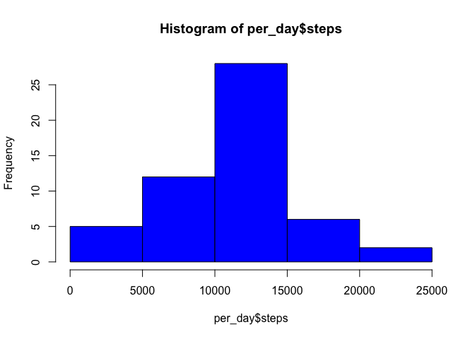
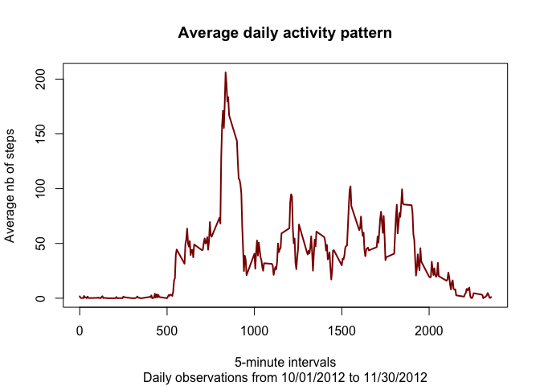
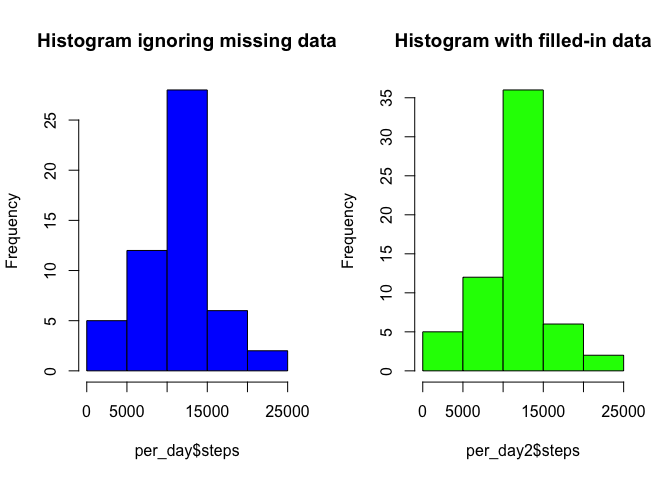
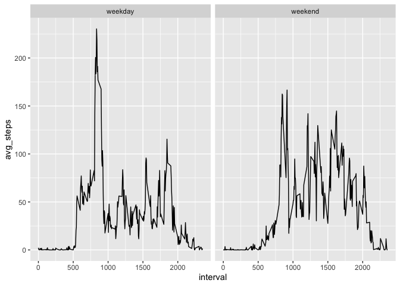

```r
library(dplyr)
```

```
## 
## Attaching package: 'dplyr'
```

```
## The following objects are masked from 'package:stats':
## 
##     filter, lag
```

```
## The following objects are masked from 'package:base':
## 
##     intersect, setdiff, setequal, union
```

```r
library(ggplot2)
```

This assignment makes use of data from a personal activity monitoring device. This device collects data at 5 minute intervals through out the day. The data consists of two months of data from an anonymous individual collected during the months of October and November, 2012 and include the number of steps taken in 5 minute intervals each day.  


### 1 - Loading and processing the data


Raw data are imported from the following website: <https://d396qusza40orc.cloudfront.net>, in a zip file rawdata.zip, saved in a dedicated folder "Data" in the working directory.  
After unzipping the original file, the resulting activity.csv file is uploaded in a dataset "activity". 


```r
# Upload data from the internet, save it in dedicated folder "Data", and unzip it
if (!file.exists("Data")){
      dir.create("Data")}
download.file("https://d396qusza40orc.cloudfront.net/repdata%2Fdata%2Factivity.zip",
              destfile = "data/rawdata.zip", method = "curl")
unzip("data/rawdata.zip", exdir = "Data")
activity <- read.csv("data/activity.csv", header = TRUE, na.strings = "NA")
```

The structure of the dataset "activity" is summarized below:


```r
str(activity)
```

```
## 'data.frame':	17568 obs. of  3 variables:
##  $ steps   : int  NA NA NA NA NA NA NA NA NA NA ...
##  $ date    : Factor w/ 61 levels "2012-10-01","2012-10-02",..: 1 1 1 1 1 1 1 1 1 1 ...
##  $ interval: int  0 5 10 15 20 25 30 35 40 45 ...
```
  
### 2 - Total number of steps taken per day

Let's first look at the total number of steps taken per day, and build an histogram to illustrate it.  
NB: Considering that some interval/date have missing information on nb of steps, we will just ignore such records at this stage, and create a new dataset activity_clean for this purpose.


```r
clean_activity <- activity[!is.na(activity$steps),]
per_day <- clean_activity %>% group_by(date) %>% summarize(steps = sum(steps))
hist(per_day$steps, col = "blue")
```

<!-- -->

In this *clean* dataset, the **mean** of the total number of steps taken per day is **10,766.19** and the **median 10,765**.


```r
format(mean(per_day$steps), nsmall=1, big.mark=",")
```

```
## [1] "10,766.19"
```

```r
format(median(per_day$steps), nsmall=1, big.mark=",")
```

```
## [1] "10,765"
```

## 3 - Average daily activity pattern

Let's now look at the average daily activity pattern.  
For this purpose, we will first compute the mean nb of steps per 5-minute interval across the 2-month daily observations. We will then build a time series plot to illustrate the daily activity pattern.


```r
per_interval <- clean_activity %>% group_by(interval) %>% summarize(avg_steps = mean(steps))
plot(per_interval, type ="l", col = "darkred", lwd = 2,
     main = "Average daily activity pattern",
     sub = "Daily observations from 10/01/2012 to 11/30/2012", 
     xlab = "5-minute intervals",
     ylab ="Average nb of steps")
```

<!-- -->

Looking at the pattern, **the 5-minute interval containing the maximum number of steps** (on average across all the days in the dataset) would then be: **835**.


```r
per_interval$interval[which(per_interval$avg_steps == max(per_interval$avg_steps))]
```

```
## [1] 835
```

  
  
## 4 - Dealing with missing data

Now, let's reconsider the original dataset and look at the impact of missing nb of steps (which we have so far ignored).  
There are **2304 missing records**, out of the 17,568 observations.


```r
sum(is.na(activity$steps))
```

```
## [1] 2304
```

To fill in the gaps, let's assume that the missing nb of steps for a given day and interval is the average nb of steps for that same interval across all days where data are available.  
It tuns out we already have build a dataframe containing the mean of nb of steps per interval, when we looked at daily activity pattern (dataframe *per_interval*). Here are the first rows:


```r
head(per_interval)
```

```
## # A tibble: 6 x 2
##   interval avg_steps
##      <int>     <dbl>
## 1        0    1.72  
## 2        5    0.340 
## 3       10    0.132 
## 4       15    0.151 
## 5       20    0.0755
## 6       25    2.09
```

We now just have to replace missing data using this *per_interval* dataframe:


```r
activity_new <- activity
activity_new$steps[is.na(activity_new$steps)] <- per_interval$avg_steps[match(activity_new$interval,per_interval$interval)]
```

```
## Warning in activity_new$steps[is.na(activity_new$steps)] <-
## per_interval$avg_steps[match(activity_new$interval, : number of items to replace
## is not a multiple of replacement length
```

And looking at the first row of the *new clean dataframe* **"activity_new"**, we can see that missing data are now filled with daily averages:


```r
head(activity_new)
```

```
##       steps       date interval
## 1 1.7169811 2012-10-01        0
## 2 0.3396226 2012-10-01        5
## 3 0.1320755 2012-10-01       10
## 4 0.1509434 2012-10-01       15
## 5 0.0754717 2012-10-01       20
## 6 2.0943396 2012-10-01       25
```

Considering this new dataframe, let's now rebuild an histogram of the total number of steps taken each day, and compare it with the histogram we built omitting missing data:


```r
per_day2 <- activity_new %>% group_by(date) %>% summarize(steps = sum(steps))
par(mfcol = c(1,2))
hist(per_day$steps, col = "blue", main = "Histogram ignoring missing data")
hist(per_day2$steps, col = "green", main = "Histogram with filled-in data")
```

<!-- -->

The **mean** of the total number of steps taken per day is now **10,766.19** and the **median 10,766.19**.


```r
format(mean(per_day2$steps), nsmall=1, big.mark=",")
```

```
## [1] "10,766.19"
```

```r
format(median(per_day2$steps), nsmall=1, big.mark=",")
```

```
## [1] "10,766.19"
```

Filling in missing data using the average nb of steps reported per 5-minutes interval between 10/01/2012 and 11/30/2012 has therefore the following **impact on:**  
**- mean: 0** (which is not surprising, considering we replaced missing value by the mean)  
**- median: 1.1886792**  


```r
mean(per_day2$steps) - mean(per_day$steps)
```

```
## [1] 0
```

```r
median(per_day2$steps) - median(per_day$steps)
```

```
## [1] 1.188679
```

  
## 5 - Weekdays and weekends activity patterns

Using the new dataset with filled-in data, let's now see whether of not activity patterns vary between weekdays and weekends.

Let's start by creating a new factor "day_type":


```r
weekend <- c("Saturday", "Sunday")

convert_date <- function(x) {
      x <- weekdays(as.Date(x))
      if(x %in% weekend) {
            day <- "weekend"
      } else {
            day <- "weekday"
      }
}

day_type <- matrix(unlist(lapply(activity_new$date, convert_date)))
activity_new <- cbind(activity_new,day_type)
activity_new$day_type <- factor(activity_new$day_type)
```

We can now compare time series plot of the 5-minute interval and the average number of steps taken, averaged across all weekday days or weekend days:


```r
per_interval2 <- activity_new %>% group_by(interval, day_type) %>% summarize(avg_steps = mean(steps))
p <- ggplot(per_interval2, aes(x=interval,y=avg_steps)) + geom_line() + facet_grid(.~day_type)
print(p)
```

<!-- -->


As the plots illustrate, activity in weekends is more constant within the day, and does not present a large peak around interval 835.
